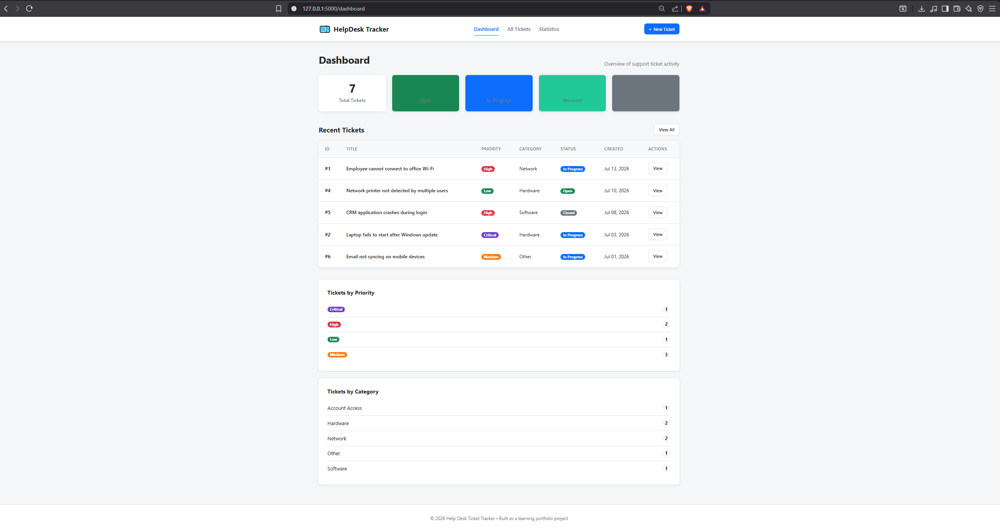
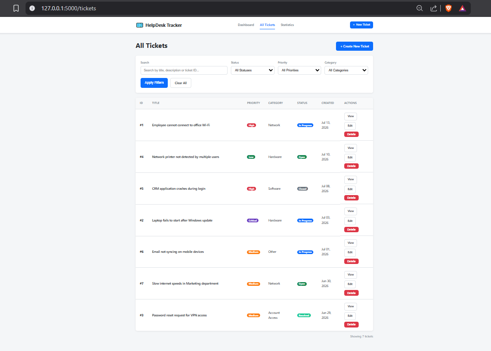
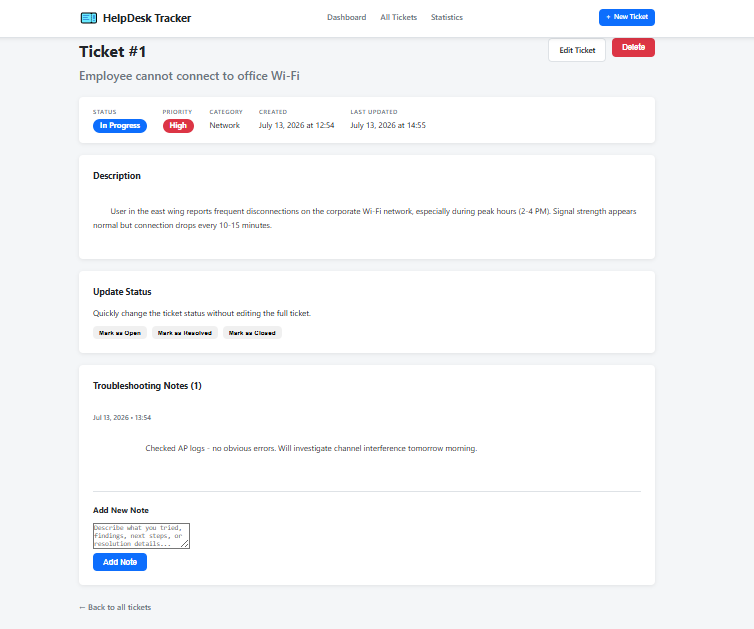
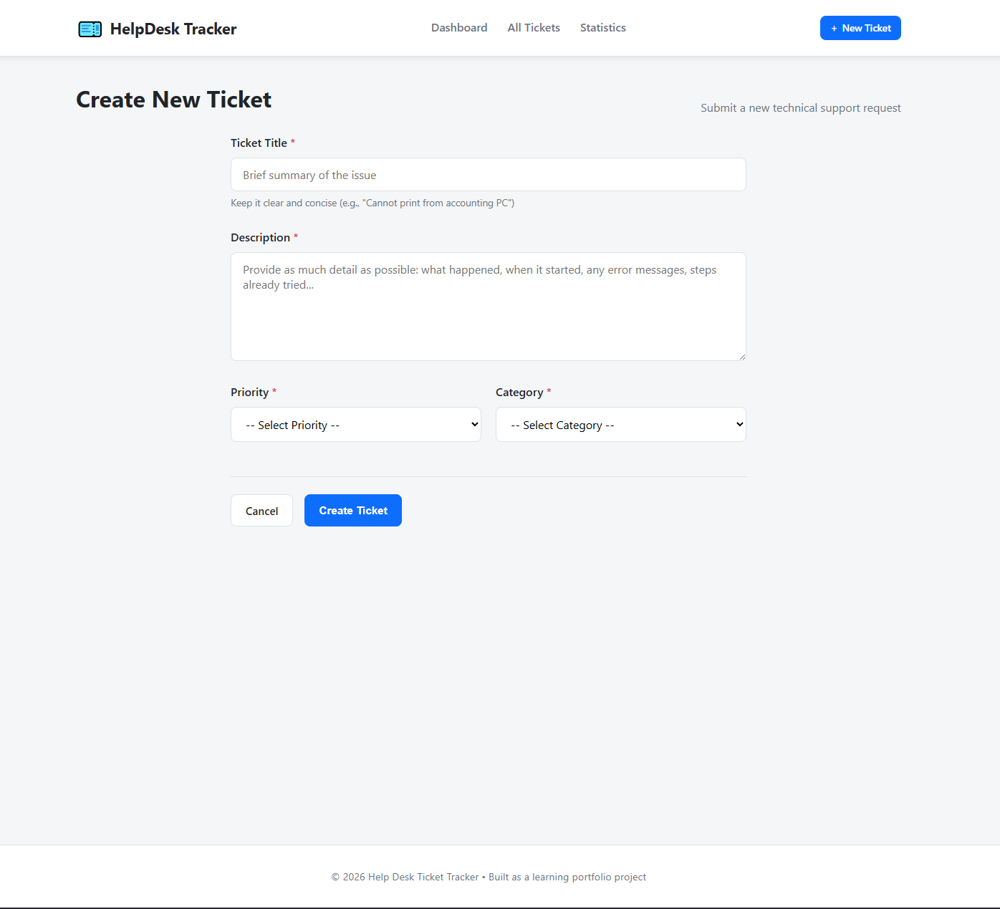

# Help Desk Ticket Tracker

A clean, professional, beginner-friendly web application for managing technical support tickets. Built with Python, Flask, SQLite, and custom CSS as a portfolio project.


## Features

- **Create, view, edit, and delete** support tickets
- **Priority levels**: Low, Medium, High, Critical
- **Categories**: Hardware, Software, Network, Account Access, Other
- **Status workflow**: Open → In Progress → Resolved → Closed
- **Troubleshooting notes**: Add chronological notes to any ticket
- **Powerful search**: Search by title, description, or ticket ID
- **Advanced filters**: Combine status, priority, and category filters
- **Dashboard**: At-a-glance statistics and recent tickets
- **Detailed statistics page**: Breakdowns with percentages and progress bars
- **Professional UI**: Responsive design, status/priority badges, empty states, flash messages
- **Data validation** and helpful error messages
- **Custom 404 and 500 error pages**
- **Sample data seeder** for quick demos

## Technologies Used

- **Backend**: Python 3, Flask, Flask-SQLAlchemy
- **Database**: SQLite (file-based, perfect for local/portfolio use)
- **Frontend**: Jinja2 templates + pure custom CSS (no heavy frameworks)
- **Version Control**: Git + GitHub ready

## Screenshots

### Dashboard


### All Tickets (Search & Filters)


### Ticket Details + Notes


### Create New Ticket Form


## Installation & Running the Application

### 1. Clone or Download the Project

```bash
git clone <your-repo-url>
cd help-desk-ticket-tracker
```

Or download the ZIP and extract it.

### 2. Create a Virtual Environment

```bash
# Windows
python -m venv venv
venv\Scripts\activate

# macOS / Linux
python3 -m venv venv
source venv/bin/activate
```

### 3. Install Dependencies

```bash
pip install -r requirements.txt
```

### 4. Run the Application

```bash
python app.py
```

The app will start on **http://127.0.0.1:5000**

The database (`tickets.db`) will be created automatically inside the `instance/` folder on first run.

### 5. (Optional) Seed Sample Data

Populate the database with 7 realistic tickets + notes:

```bash
python seeds.py
```

Refresh the browser to see the demo data.

## Project Structure

```
help-desk-ticket-tracker/
├── app.py                 # Main Flask application + all routes
├── models.py              # SQLAlchemy models (Ticket + TroubleshootingNote)
├── seeds.py               # Script to insert realistic sample data
├── requirements.txt
├── README.md
├── .gitignore
├── instance/              # Contains tickets.db (auto-created, gitignored)
├── static/
│   └── css/
│       └── style.css      # Complete professional styling
└── templates/
    ├── base.html          # Layout with navbar + flash messages
    ├── dashboard.html
    ├── tickets.html       # List + search/filters
    ├── create_ticket.html
    ├── edit_ticket.html
    ├── ticket_details.html
    ├── statistics.html
    ├── 404.html
    └── 500.html
```

## How to Use

1. Go to the **Dashboard** to see overall stats and recent activity.
2. Click **+ New Ticket** to create a support request.
3. On the **All Tickets** page you can search and filter.
4. Click any ticket to see details, add notes, or quickly change status.
5. Use the **Statistics** page for deeper insights and breakdowns.

## Testing Checklist

- [ ] Create a ticket with all fields
- [ ] Create ticket with missing required fields (validation works)
- [ ] View ticket list and use search by title/ID
- [ ] Apply status, priority, and category filters (individually and combined)
- [ ] Edit a ticket (change title, priority, status, etc.)
- [ ] Delete a ticket (with confirmation)
- [ ] Add multiple troubleshooting notes to a ticket
- [ ] Notes appear in chronological order
- [ ] Quick status change buttons work from details page
- [ ] Dashboard shows correct counts and recent tickets
- [ ] Statistics page shows percentages
- [ ] 404 page shows for invalid ticket ID
- [ ] Empty states appear when no tickets match filters
- [ ] Responsive on mobile (try resizing browser)

## Suggested Git Commit History

```bash
# After creating the project folder and basic files
git add .
git commit -m "chore: initial project structure and dependencies"

git add app.py models.py
git commit -m "feat: add SQLAlchemy models and Flask application skeleton"

git add templates/ static/css/
git commit -m "feat: implement all HTML templates and professional CSS styling"

git add seeds.py
git commit -m "feat: add sample data seeder with realistic tickets and notes"

git add README.md
git commit -m "docs: write comprehensive README with setup and usage instructions"
```

## Future Improvements (Ideas for v2)

- User authentication (login/register)
- Role-based access (Admin vs Technician)
- File attachments on tickets
- Email notifications when status changes
- REST API + Vue.js or React frontend
- PostgreSQL instead of SQLite
- Docker + docker-compose
- Ticket assignment to specific technicians
- Full activity history / audit log
- Dark mode
- Export tickets to CSV/PDF

## What I Learned by Building This Project

- How to structure a real Flask application with separate models and routes
- Proper use of SQLAlchemy relationships, foreign keys, and cascades
- Server-side form validation and user feedback with flash messages
- Building responsive UIs with pure CSS (no Bootstrap dependency)
- Writing clean, maintainable code with helper functions and constants
- Creating a professional portfolio piece that demonstrates full-stack skills

## Resume Bullet Points (Ready to Use)

- Built a full-stack Help Desk Ticket Tracker web application using Flask, SQLAlchemy, SQLite, and Jinja2 templates, enabling users to create, manage, search, filter, and track technical support tickets with troubleshooting notes.
- Designed and implemented a normalized relational database schema with one-to-many relationships, cascade deletes, automatic timestamps, and server-side validation for priority, category, and status fields.
- Created a clean, responsive, professional user interface using custom CSS featuring dynamic stat cards, searchable/filterable data tables, status badges, chronological notes, empty states, and custom error pages — all without external frontend frameworks.

## Interview Questions You Might Be Asked

**Q: Why did you choose SQLite instead of PostgreSQL?**  
A: For a portfolio project and local development, SQLite is perfect because it's file-based, requires zero configuration, and is included with Python. It allowed me to focus on the application logic rather than database server setup. The code is easily portable to PostgreSQL later by just changing the connection string.

**Q: How does the one-to-many relationship between tickets and notes work?**  
A: I defined a `notes` relationship on the Ticket model with `backref='ticket'` and `cascade='all, delete-orphan'`. This lets me access `ticket.notes` easily and ensures that when a ticket is deleted, all its associated notes are automatically removed from the database.

**Q: How did you handle validation?**  
A: I used a combination of HTML5 `required` attributes for basic client-side checks and robust server-side validation in the route handlers. I centralized allowed values in lists (`ALLOWED_PRIORITIES`, etc.) and checked submitted data against them, flashing clear error messages when validation failed.

**Q: What would you do differently if you were to scale this app?**  
A: I would introduce user authentication and roles, move to PostgreSQL, add a REST API layer, consider a frontend framework like Vue.js for a richer UI, add file uploads, and containerize everything with Docker. The current architecture makes these upgrades straightforward.

---

**Author**: Built as a learning/portfolio project by a developer focused on clean code and practical full-stack skills.

Happy ticket tracking! If you have any questions or want to extend the project, feel free to open an issue or reach out.